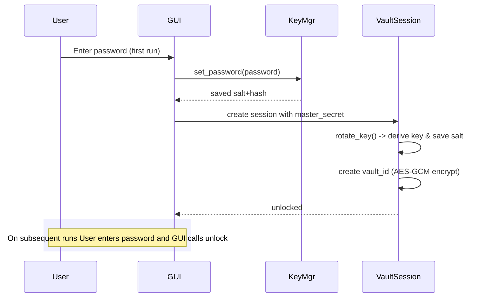

# Algorithms and Cryptographic Design

This document summarizes the cryptographic algorithms and formats used by NetToss Rolling File Vault.

## Overview
- Master password handling: PBKDF2-HMAC-SHA256 (password hashing + key derivation)
- Symmetric encryption: AES (GCM/CBC/ECB), DES (CBC/ECB), 3DES (CBC/ECB)
- Randomness: `Crypto.Random.get_random_bytes()` for salts, IVs, nonces, and vault-id
- Padding: PKCS#7 for block modes (CBC, ECB)
- Integrity: AES-GCM authentication tag; for non-AEAD modes integrity is not authenticated
- Metadata storage: `storage/metadata.json` stores password salt/hash/iterations and derived key salts

## Password handling
- Passwords are salted and hashed with PBKDF2-HMAC-SHA256 using a per-password 16-byte salt and an iteration count (DEFAULT_ITERATIONS = 200000).
- Stored metadata excerpt (JSON):

```json
{
  "password": {
    "salt": "<hex>",
    "hash": "<hex>",
    "iterations": 200000
  },
  "keys": {
    "<key_salt_hex>": "<derived_key_hex>"
  }
}
```

- Verification uses a constant-time comparison (`hmac.compare_digest`) between computed PBKDF2 output and stored hash.
- Key derivation for encryption keys uses PBKDF2-HMAC-SHA256 with the master password and a per-key salt.

## File encryption format
- Encrypted file header (first line) is a JSON blob followed by a newline. Fields include `nonce`, `iv`, `tag` depending on algorithm/mode.
- Example header stored in file (text):

```json
{"nonce":"...","iv":"...","tag":"..."}\n
<binary ciphertext>
```

- AES-GCM: uses `nonce` and `tag` for authenticated encryption/decryption. Decryption verifies tag to assert integrity.
- AES-CBC / AES-ECB / DES / 3DES: use PKCS#7 padding; no built-in authentication — integrity is "not_verified" in current implementation.

## Algorithms details
- AES
  - Key material: first 32 bytes of derived key (AES-256). Modes supported: GCM, CBC, ECB.
  - GCM provides confidentiality + integrity (uses `cipher.encrypt_and_digest` / `cipher.decrypt_and_verify`).
  - CBC/ECB require PKCS#7 padding; IV is stored in header as hex string.

- DES
  - Key: first 8 bytes of derived key; modes: CBC, ECB. No GCM support.

- 3DES
  - Key: first 24 bytes of derived key; modes: CBC, ECB. No GCM support.

- PBKDF2 parameters
  - Hash: SHA-256
  - Iterations: configurable, default 200,000
  - Output length: 32 bytes (256 bits)

## Vault identity
- On first unlock a random `vault_id` is generated and encrypted with AES-GCM using the derived key; the encrypted blob is saved to `storage/vault_id.bin`.
- On subsequent unlock attempts the blob is decrypted using the derived key to verify the password is correct. If decryption fails the unlock is rejected.

## Security remarks
- Use a strong password. If the master password is lost, stored vault data cannot be decrypted.
- AES-GCM authenticated encryption is used where available; CBC/ECB modes do not provide integrity protection.
- Iteration count for PBKDF2 is intentionally high to slow brute-force; it can be tuned in `core/key_manager.py`.

## Diagrams

### First-run / Unlock sequence (mermaid sequence diagram)



### Encrypt / Decrypt flow (mermaid flowchart)

```mermaid
flowchart TD
    A[Select file] --> B{Choose algorithm/mode}
    B -->|AES-GCM| C[Derive key (PBKDF2) -> AES-GCM encrypt]
    B -->|AES-CBC| D[Derive key -> PKCS7 pad -> AES-CBC encrypt]
    C --> E[Write header JSON (nonce, tag) + ciphertext]
    D --> E
    E --> F[Save to storage/encrypted/]

    subgraph Decrypt
      G[Read header + ciphertext] --> H{Mode}
      H -->|GCM| I[AES-GCM decrypt & verify tag]
      H -->|CBC/ECB| J[AES decrypt -> PKCS7 unpad]
    end
```

### Metadata / Storage layout (visual)

- `storage/metadata.json` : stores password salt/hash/iterations and key salts/derived keys (hex)
- `storage/vault_id.bin` : encrypted JSON blob (nonce/ciphertext/tag)
- `storage/encrypted/` : encrypted files with `.enc` extension and header
- `storage/decrypted/` : decrypted output files (written when user exports)

## References (code locations)
- Password & key handling: [core/key_manager.py](../core/key_manager.py)
- Vault session and vault identity: [core/vault_session.py](../core/vault_session.py)
- Encryption / file format handling: [gui/app.py](../gui/app.py) and [core/crypto_engine.py](../core/crypto_engine.py)


## Notes & next steps
- Add an HMAC or envelope authenticated encryption for all non-AEAD modes to provide integrity.
- Consider using scrypt or Argon2 for password hashing if available for better GPU resistance.


---
*Generated by developer tooling — update as implementation evolves.*
